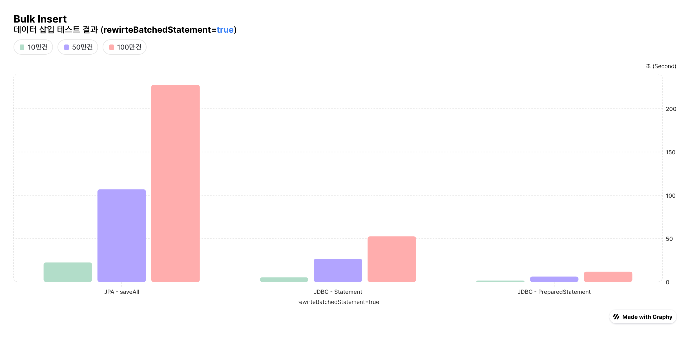

# 상품 관리 시스템 (Product Management System)

## 시스템 개요

3가지 사용자 역할을 가진 상품 관리 시스템으로, 판매자가 등록한 상품을 관리자가 검수한 후 배치 처리를 통해 실제 서비스에 반영하는 구조입니다.

## 시스템 구성

### 사용자 역할
- **관리자(Admin)**: 상품 검수 승인/거부
- **판매자(Seller)**: 상품 등록
- **고객(Customer)**: 상품 검색/구매

### 2단계 상품 관리
- **검수 테이블(pending_products)**: 판매자가 등록한 상품의 임시 저장소
- **서비스 테이블(products)**: 승인된 상품들이 고객에게 노출되는 실제 서비스 테이블

## 상품 등록 및 관리 플로우

### 1. 판매자 상품 등록
- 판매자가 상품 정보 입력 (상품명, 설명, 가격)
- 검수 테이블(pending_products)에 임시 저장
- 상태: `PENDING` (검수 대기)

### 2. 관리자 검수 프로세스
- 관리자가 등록된 상품들을 검토
- 상태 변경: `PENDING` → `APPROVED` 또는 `REJECTED`
- 거부 시 사유 기록

### 3. 배치 처리를 통한 서비스 반영
- **스케줄**: 매일 새벽 2시 자동 실행
- **처리 방식**: BULK INSERT를 활용한 대용량 데이터 처리
- 승인된 상품들을 서비스 테이블(products)로 이관
- 고객들은 이관 완료 후 상품 검색/구매 가능

### 4. 상품 검색 기능
- **단순 검색**: LIKE 연산을 통한 상품명/설명 검색
- **전문 검색**: MySQL FULLTEXT 검색 지원 (향후 확장)
- 검색 성능 최적화를 위한 인덱스 설정

---

# Bulk Insert 테스트 결과

### rewriteBatchedStatements = false 환경


| 구분           | JDBC PreparedStatement | JDBC Statement | JPA saveAll() |
|--------------|------------------------|----------------|---------------|
| **총 소요시간**   | 196.3초                 | 198.8초         | 208.9초        |
| **초당 처리량**   | 5,093건/sec             | 5,028건/sec     | 4,786건/sec    |
| **배치당 평균시간** | 1.96초                  | 1.99초          | 2.09초         |

발생하는 쿼리 모두 1건씩 실행된다.

- JPA: PK 채번을 위해 1건씩 INSERT를 실행하여 총 1,000,000건의 INSERT 쿼리 실행
    - `GenerationType.IDENTITY` ID에 대해서는 Batch Insert가 작동하지 않는다.
    - ID를 리턴받아 Entity 객체에 채워줘야 하기 때문에 1건씩 INSERT 쿼리를 실행할 수 밖에 없다.
- Statement & PreparedStatement: rewriteBatchedStatements 옵션이 false로 설정되어 있어 1건씩 INSERT 쿼리 실행

```sql
-- 100만번의 쿼리 발생
INSERT INTO products VALUES ('Product 1', 'Description 1', 10.0, ...);
INSERT INTO products VALUES ('Product 2', 'Description 2', 20.0, ...);
INSERT INTO products VALUES ('Product 3', 'Description 3', 30.0, ...);
```

즉, Multi value INSERT를 활용하지 못해 모두 비슷한 성능을 보이고 있다.

### rewriteBatchedStatements = true 환경



| 구분           | JDBC PreparedStatement | JDBC Statement | JPA saveAll() |
|--------------|------------------------|----------------|---------------|
| **총 소요시간**   | 11.8초                  | 52.6초          | 227.6초        |
| **초당 처리량**   | 84,488건/sec            | 19,016건/sec    | 4,393건/sec    |
| **배치당 평균시간** | 0.12초                  | 0.53초          | 2.28초         |

- JPA: 여전히 각 엔티티마다 별도 INSERT 쿼리 발생
    - Auto Increment 전략 사용 시 JDBC 드라이버의 batch rewrite 기능이 동작하지 않음.
    - 대량 삽입에서도 단건 쿼리가 반복됨.
- Statement: multi-value INSERT 쿼리로 합쳐서 전송
    - 단, Statement는 **SQL 파싱 오버헤드가 존재**
    - 직전에 사용했던 동일한 쿼리라도 매번 SQL 파싱 비용이 발생
- PreparedStatement: multi-value INSERT 쿼리로 합쳐서 전송
    - 최초 1회만 SQL 파싱을 수행하고, 이후 반복 사용 시 파싱된 쿼리(실행 계획)를 재사용 &rarr; 캐시 효과 발생
    - 파싱 오버헤드가 없고, 네트워크 round trip 비용도 절감되어 가장 빠른 성능을 보임

```sql
INSERT INTO products VALUES 
    ('Product 1', 'Description 1', 10.0, ...),
    ('Product 2', 'Description 2', 20.0, ...),
    ('Product 3', 'Description 3', 30.0, ...),
```

**정리**

- JPA - saveAll() 은 ORM 매핑 및 키 생성 정책 한계로 배치 효과를 보지 못해 성능상 이점을 얻기 어려움
- JDBC - Statement는 batch rewrite 기능은 활용할 수 있으나, 매번 SQL 파싱으로 인해 추가 오버헤드 발생
- JDBC - PreparedStatement는 SQL 파싱 오버헤드 제거 및 batch rewrite 기능을 모두 효과적으로 활용하여 가장 뛰어난 성능을 보임

## 참고 자료

- https://techblog.woowahan.com/2695/
- https://kwonnam.pe.kr/wiki/java/hibernate/batch

